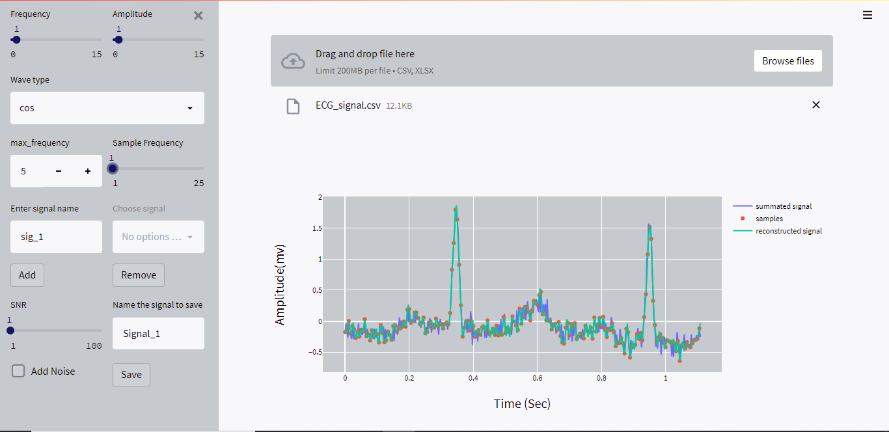
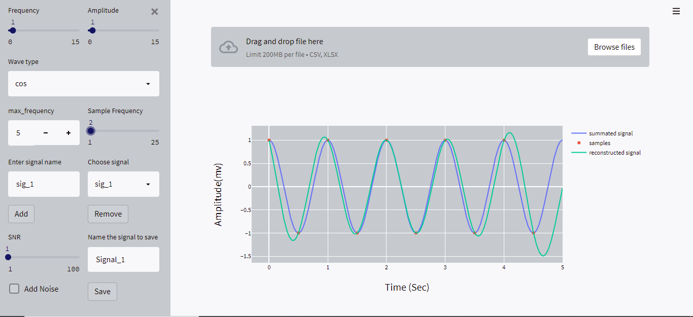
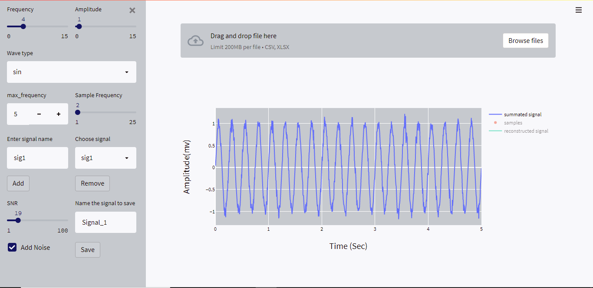
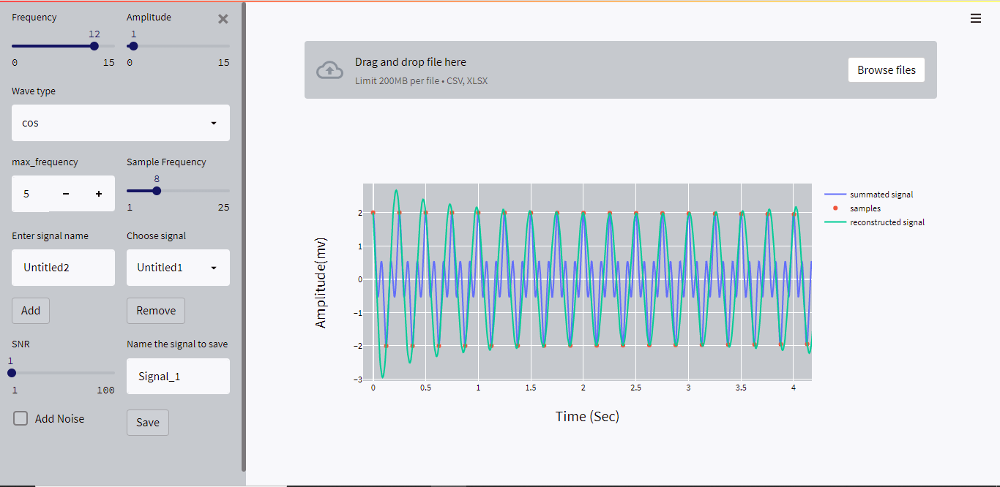

# DSP-Sampling Studio

## Main idea :
### This Demo uses the signal processing techniques to deal with different signals in different states and with different action ( sampling , composing , reconstructing samples )
## Features:
* read csv signal and see the sampled points highlighted on top of the signal.
* Developing an illustrator for the signal recovery that shows Nyquist rate.
* Change the sampling rate via a slider that range from 0 Hz to 10f max
* Reconstruct/recover the signal from the sampled points.
* Generate basic signals to test and validate on the app.
* Saving and downloading the signal as a CSV file to be used later

## Demos:
### 
### 
### 
### 


## Run-App
1.install project dependencies
```
pip install -r requirements.txt
```
## Run the application
```
python app.py
```
